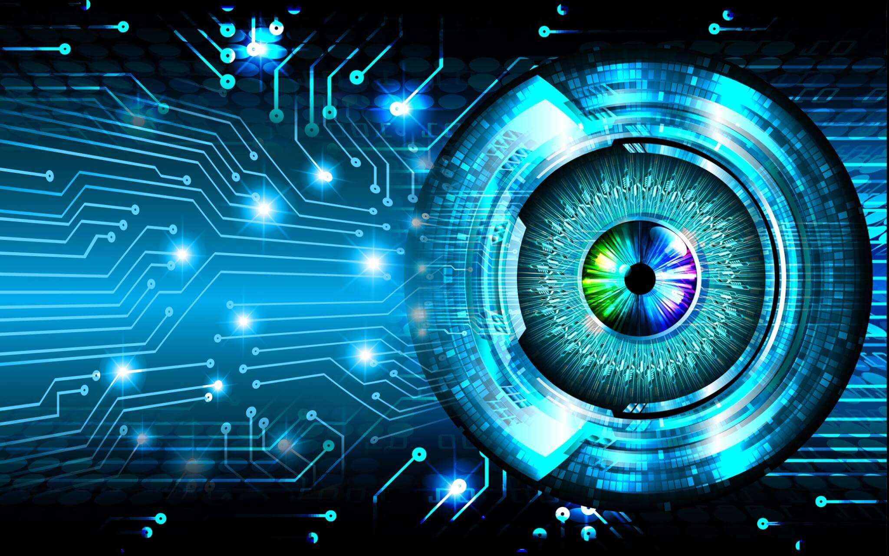

# Computer-Vision-Projects

Computer Vision is what allow computer to see and preprocess the visualize data just like humans. It is a branch of Computer Science that learn computer how to see an image and then preprocess and then give output.

This repository is all about projects regarding Computer Vision. 

